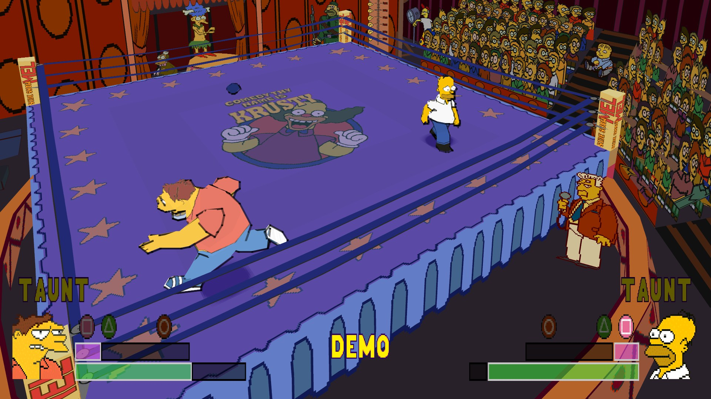
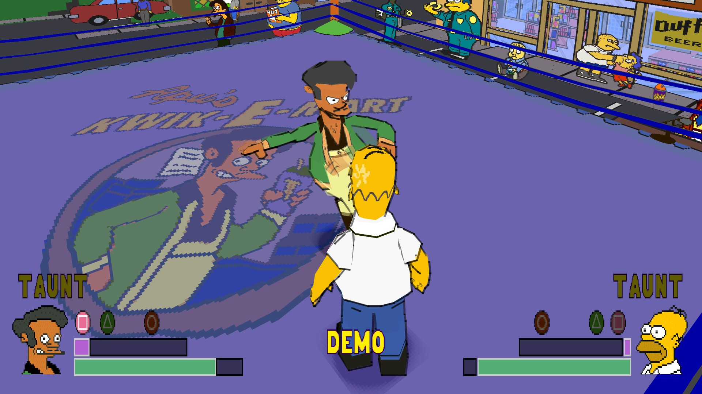
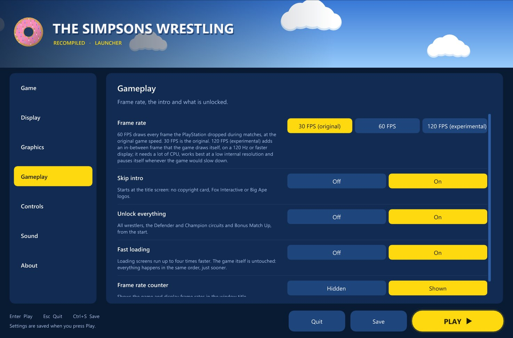

 

### The Simpsons Wrestling on PC, running natively. Widescreen, HD, 60 FPS, everything unlocked.

The original PlayStation game code, translated to native PC code with <a href="https://github.com/mstan/psxrecomp">psxrecomp</a>. <b>No game files included</b>: bring your own disc image of The Simpsons Wrestling (PlayStation, North America, SLUS-01227).

 

## Highlights

<table>
<tr>
<td width="33%" valign="top">

**16:9 widescreen** 
Matches fill a modern screen with real extra picture: more of the arena and the crowd at the sides, and the health bars and portraits out at the screen edges.

</td>
<td width="33%" valign="top">

**HD and smooth** 
Drawn at up to 8K and scaled to your screen, with smooth outlines and none of the PlayStation's wobbling polygons.

</td>
<td width="33%" valign="top">

**60 FPS at the real game speed** 
Matches run at a smooth 60 frames a second (the original manages 20-30), and Homer still moves exactly as fast as he did in 2001.

</td>
</tr>
<tr>
<td valign="top">

**Straight to the action** 
The intro movies are skipped and every wrestler, both circuits and Bonus Match Up are unlocked from the start. Both can be switched back off.

</td>
<td valign="top">

**Your controls** 
Xbox, PlayStation and other controllers work out of the box, with vibration. Two players can play, on two controllers or a controller and the keyboard. Remap any button.

</td>
<td valign="top">

**Native, not emulated** 
Every function of the game was translated from PlayStation code to C and compiled for your PC. Your CPU runs the game directly.

</td>
</tr>
</table>

## In game

<table>
<tr>
<td width="50%"></td>
<td width="50%"></td>
</tr>
</table>

## Getting started

1. Download the release for your system and unzip it anywhere.
2. Run **`SimpsonsWrestling.exe`** (Linux: `./SimpsonsWrestling`). This opens the launcher.
3. On the **Game** page, choose the `.cue` file of your disc image, or drop it onto the window. The launcher checks that it is the USA disc. The `.bin` file must sit next to the `.cue`.
4. Press **PLAY**.

Plug your controller in before pressing PLAY: with **Automatic** (the default) player 1 gets the first controller, or the keyboard when there is none, and player 2 gets the second.

Windows may warn that the program is from an unknown publisher (it is not code-signed). Choose **More info**, then **Run anyway**.

## The launcher

| Page | What you can set |
| --- | --- |
| **Game** | Your disc image |
| **Display** | Windowed, borderless or exclusive fullscreen, window size, which monitor, widescreen, fill the screen, VSync |
| **Graphics** | Render resolution (240p to 8K, or matching your screen), smooth outlines, smooth textures, stable geometry, sharpening, brightness, CRT screen filter and scanlines |
| **Gameplay** | Frame rate (30 original, 60, or 120 experimental), skip intro, unlock everything, fast loading, frame-rate counter |
| **Controls** | Player 1 and 2 input, vibration strength, stick deadzone, controller button remapping, keyboard keys |
| **Sound** | Volume, sound delay, high-quality audio |
| **About** | Show the launcher at startup or not, open the save or game folder, reset all settings, version |

To skip the launcher, set **Show this launcher** to Off on the About page. Hold **Shift** while starting the game to bring it back.

## Controls

| PlayStation | Controller (Xbox layout) | Keyboard |
| --- | --- | --- |
| D-pad / left stick | D-pad / left stick | Arrow keys |
| Cross | A | X |
| Circle | B | S |
| Square | X | Z |
| Triangle | Y | A |
| L1 / R1 | LB / RB | Q / W |
| L2 / R2 | LT / RT | E / R |
| Start | Menu | Enter |
| Select | View | Right Shift |

Change any of them on the launcher's **Controls** page. While playing: **Alt+Enter** switches fullscreen, and the numpad **+** and **-** keys change the volume.

## Good to know

- **Saves** are memory card files in the `saves` folder next to the game (About > Open save folder). Copy that folder to keep your progress.
- **Vibration:** the game's own Options menu starts with Vibration off. Turn it on there; the launcher's Controls page sets the strength.
- **Settings** live next to the game: `launcher.txt` (the launcher), `settings.toml` (picture and sound), `input.ini` (controller) and `keybinds.ini` (keyboard).
- **Performance:** if a match runs below full speed, lower the render resolution on the Graphics page. The game keeps its normal speed either way; when the PC is busy the frame rate drops first.
- **120 FPS** is experimental. It needs a 120 Hz screen and a fast CPU, works best at low render resolutions, and you may see some flicker (the launcher explains when you choose it). 60 FPS is recommended.

## Known issues

- Pausing a match in widescreen puts the TAUNT labels back at their 4:3 positions and darkens only the middle 4:3 area until you unpause.
- 120 FPS (experimental): the ring spotlight can flicker, and on most PCs only some frames get an in-between image, so motion is not perfectly even.
- Linux builds have not yet been tested on a native Linux install.

Found something else? Please open an issue with what happened, where, and your launcher settings.

## For developers

How the port works, measurements and build instructions: [docs/TECHNICAL.md](docs/TECHNICAL.md).

## Credits

- [psxrecomp](https://github.com/mstan/psxrecomp) and its contributors
- The [TRG Launcher](https://github.com/TekRantGaming/trg-launcher)
- Cheat-code research for the NTSC-U unlock flags: the CodeBreaker code lists at almarsguides.com
- The Simpsons Wrestling is a trademark of its respective owners. This project contains no game data and is not affiliated with them.
