<div align="center">

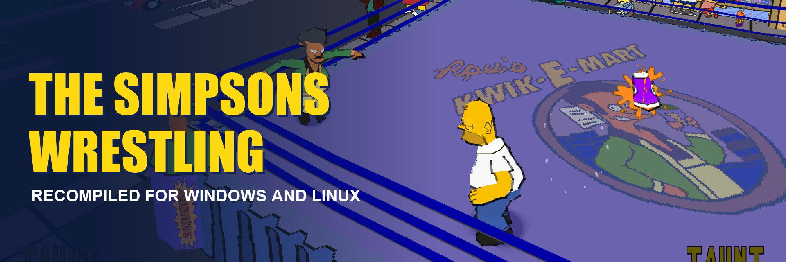

<br>

[](https://github.com/TekRantGaming/simpsons-wrestling-recompiled/releases/latest)
[](https://github.com/TekRantGaming/simpsons-wrestling-recompiled/releases)


### The Simpsons Wrestling on PC, running natively. Widescreen, HD, 60 FPS, everything unlocked.

[](https://github.com/TekRantGaming/simpsons-wrestling-recompiled/releases/latest)
&nbsp;
[](https://github.com/TekRantGaming/simpsons-wrestling-recompiled/releases/latest)

<sub>The original PlayStation game code, translated to native PC code with <a href="https://github.com/mstan/psxrecomp">psxrecomp</a>. <b>No game files included</b>: bring your own disc image of The Simpsons Wrestling (PlayStation, North America, SLUS-01227). The launcher walks you through it.</sub>

</div>

<br>

## Highlights

<table>
<tr>
<td width="33%" valign="top">

**16:9 widescreen**<br>
Matches fill a modern screen with real extra picture: more of the arena and the crowd at the sides, and the health bars and portraits out at the screen edges.

</td>
<td width="33%" valign="top">

**HD and smooth**<br>
Drawn at up to 8K and scaled to your screen, with smooth outlines and none of the PlayStation's wobbling polygons.

</td>
<td width="33%" valign="top">

**60 FPS at the real game speed**<br>
Matches run at a smooth 60 frames a second (the original manages 20-30), and Homer still moves exactly as fast as he did in 2001.

</td>
</tr>
<tr>
<td valign="top">

**Straight to the action**<br>
The intro movies are skipped and every wrestler, both circuits and Bonus Match Up are unlocked from the start. Both can be switched back off.

</td>
<td valign="top">

**Your controls**<br>
Xbox, PlayStation and other controllers work out of the box, with vibration, even when you switch them on after the game has started. Two players can play, on two controllers or a controller and the keyboard. Remap any button.

</td>
<td valign="top">

**Native, not emulated**<br>
Every function of the game was translated from PlayStation code to C and compiled for your PC. Your CPU runs the game directly.

</td>
</tr>
</table>

## The launcher

Everything is set up before the game starts. The first time you open it, the launcher asks for your disc image and checks that it is the right game; after that it opens on your settings. Settings are saved to plain text files next to the game.

<table>
<tr>
<td width="55%">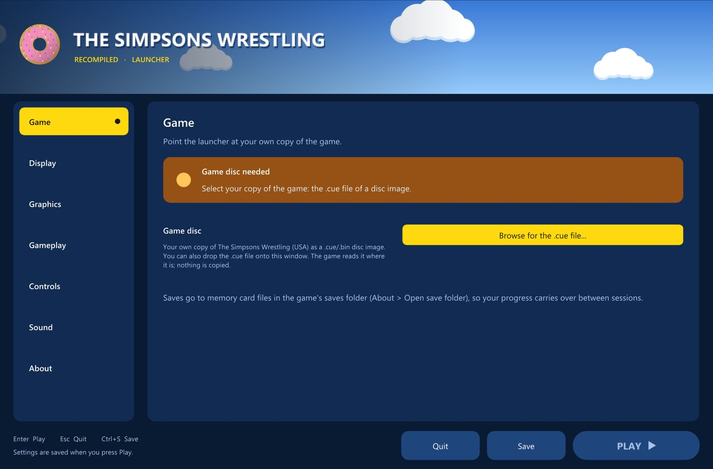</td>
<td valign="middle">

### Game
- **Bring your own disc**: pick the `.cue` file of your disc image, or drop it onto the window
- Checks it really is **The Simpsons Wrestling (USA)** before you can play
- The game reads your disc image where it is: **nothing is copied or downloaded**
- Your progress goes to **memory card files** in the `saves` folder

</td>
</tr>
<tr>
<td valign="middle">

### Display
- **Windowed**, **borderless** or **exclusive** fullscreen
- **Window size** that fits your screen
- **Choose the monitor**
- **16:9 widescreen** in matches, or the original 4:3
- **Fill the screen**, or keep the picture's shape with black bars
- **VSync** off, on or adaptive

</td>
<td width="55%">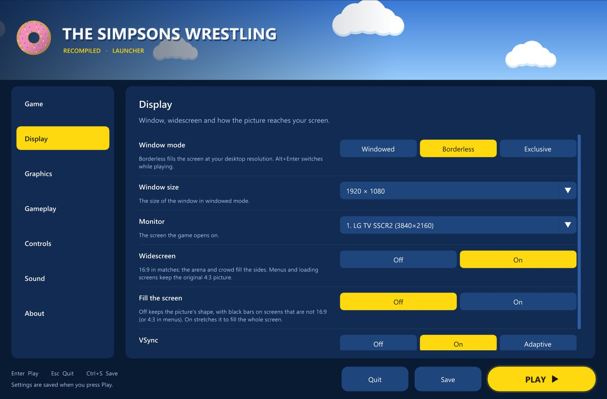</td>
</tr>
<tr>
<td>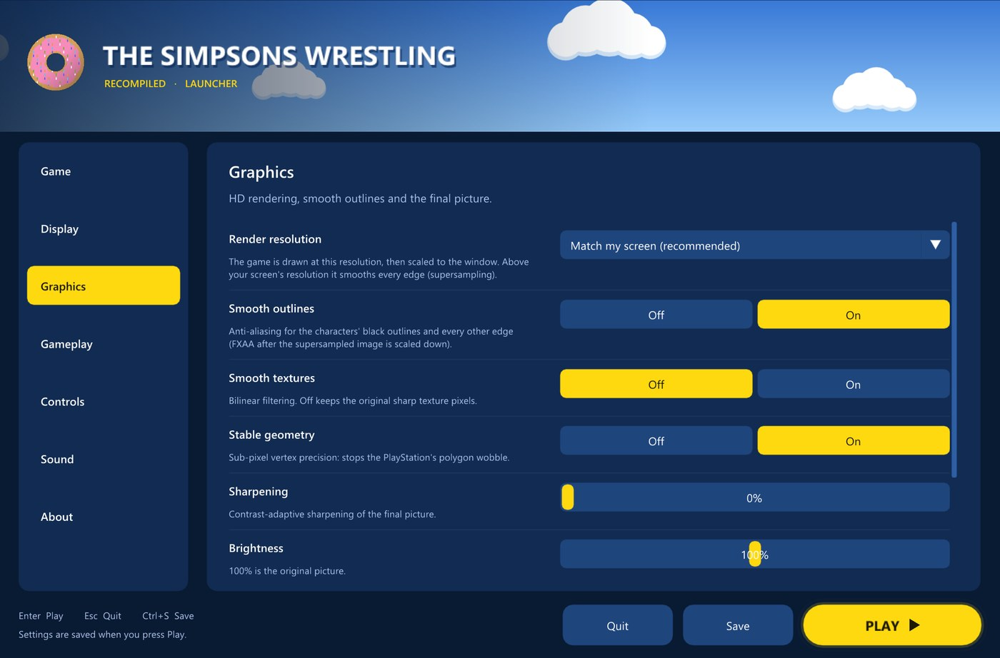</td>
<td valign="middle">

### Graphics
- **Render resolution** from 240p to 8K, or **match my screen** (the default)
- **Smooth outlines**: anti-aliasing on top of the supersampled picture
- **Smooth textures**, or the original sharp pixels
- **Stable geometry**: no more PlayStation polygon wobble
- **Sharpening** and **brightness**
- **Screen filter**: CRT, composite or Trinitron, with **scanlines**

</td>
</tr>
<tr>
<td valign="middle">

### Gameplay
- **Frame rate**: 30 (original), **60** or **120 (experimental**; the launcher explains what to expect and recommends 60)
- **Skip the intro**: straight to the title screen
- **Unlock everything**: all wrestlers, both circuits and Bonus Match Up
- **Fast loading** for the loading screens
- **Frame rate counter** in the window title

</td>
<td width="55%">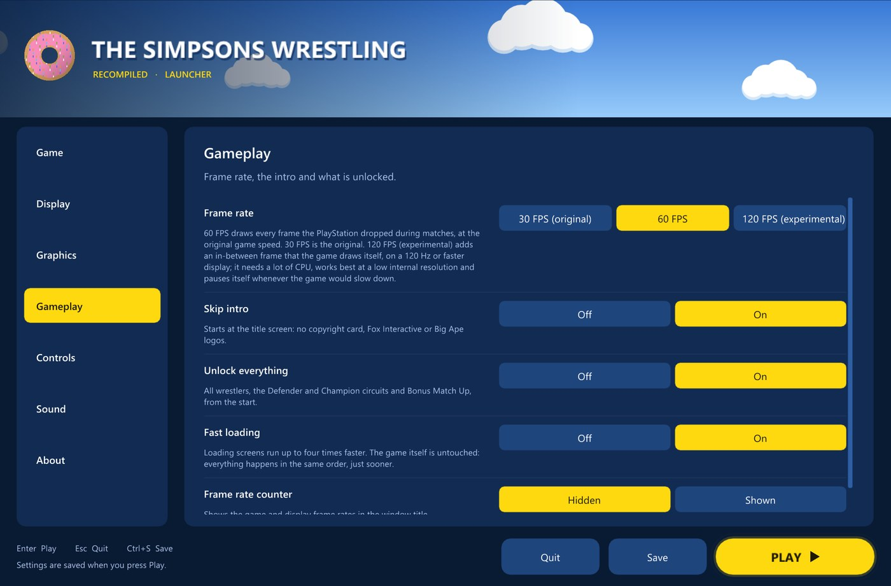</td>
</tr>
<tr>
<td>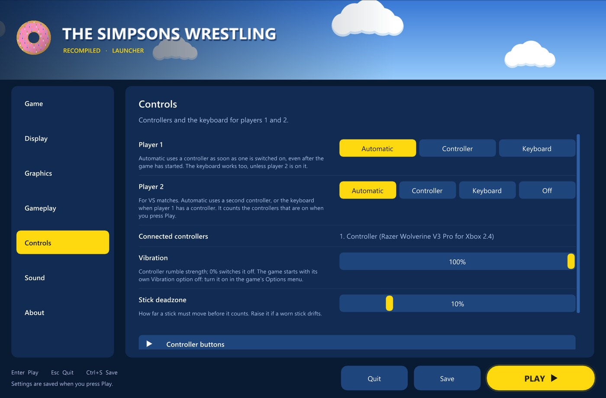</td>
<td valign="middle">

### Controls
- **Player 1 and 2**: automatic, a controller, the keyboard, or off
- Controllers are **picked up when you switch them on**, even mid-game
- **Vibration** strength
- **Stick deadzone** to stop drift
- **Remap any controller button**
- **Keyboard keys**: click a control, press a key

</td>
</tr>
<tr>
<td valign="middle">

### Sound
- **Volume**
- **Sound delay**: low, normal or safe, for PCs where the sound crackles
- **High-quality audio**: smoother resampling of the PlayStation's sound chip

</td>
<td width="55%">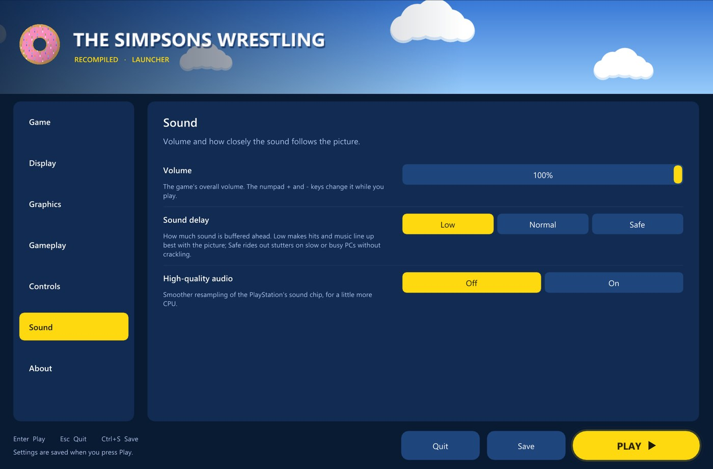</td>
</tr>
<tr>
<td>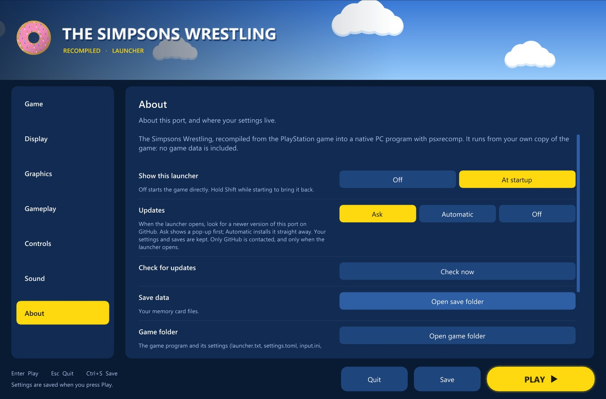</td>
<td valign="middle">

### About
- Turn the launcher off and **hold Shift** at start to bring it back
- Open your **save folder** or the **game folder** in one click
- **Reset** every setting
- The **version** you are running

</td>
</tr>
</table>

## In game

<div align="center">
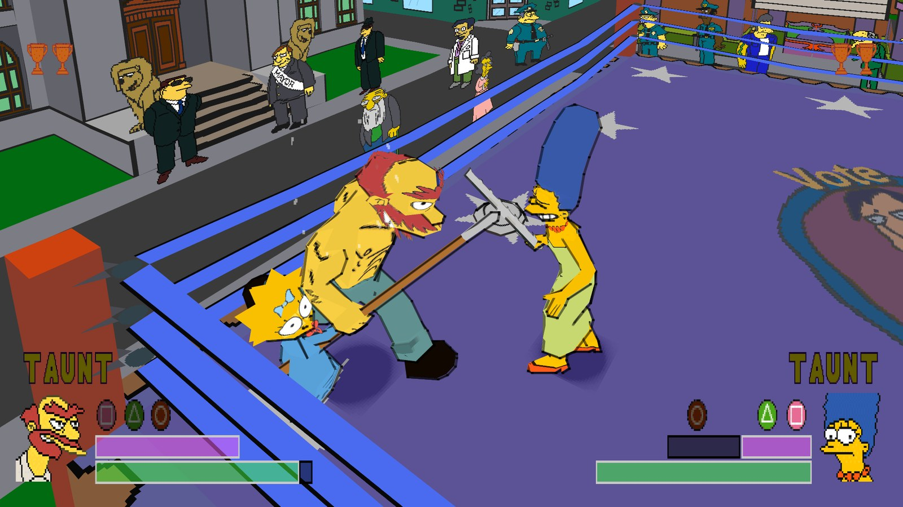
<sub>Groundskeeper Willie against Marge in the town square, in 16:9, rendered at 4K.</sub>
</div>

<br>

<table>
<tr>
<td width="50%">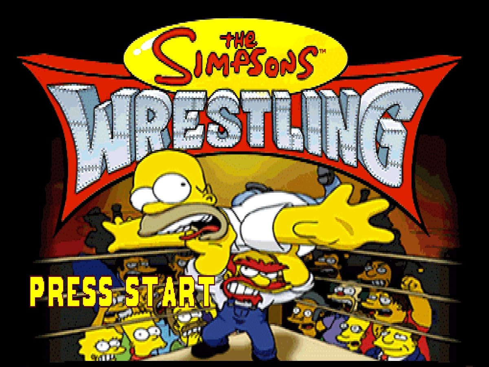</td>
<td width="50%">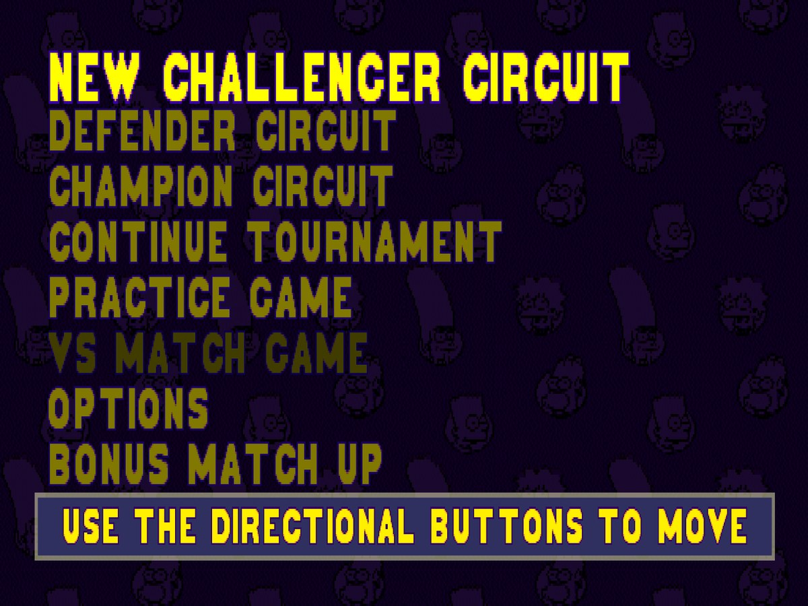</td>
</tr>
<tr>
<td>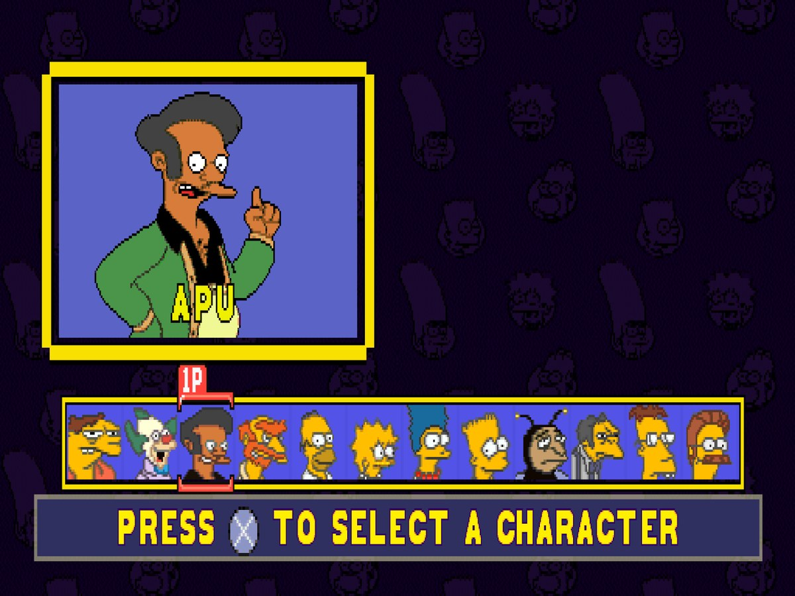</td>
<td>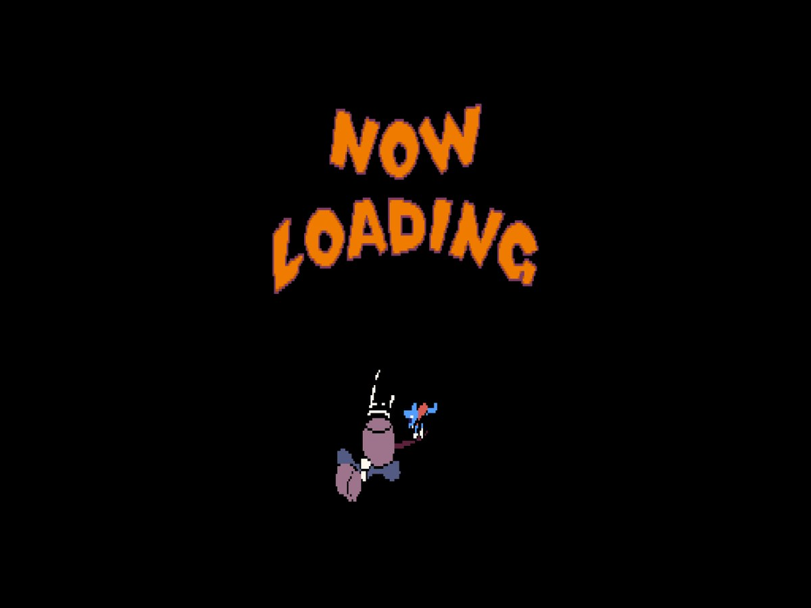</td>
</tr>
<tr>
<td>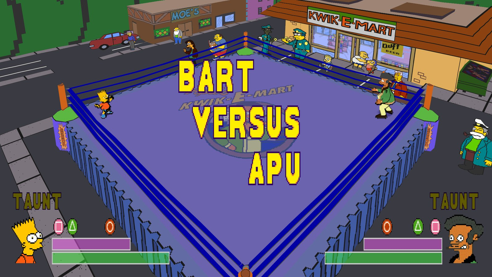</td>
<td>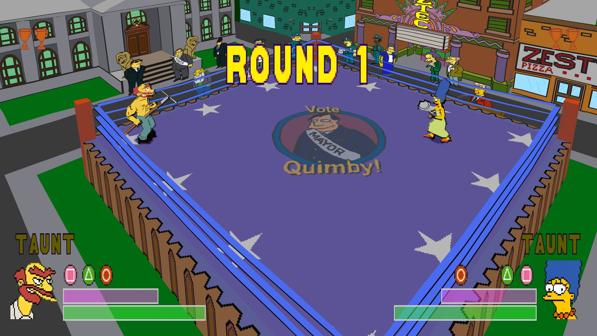</td>
</tr>
<tr>
<td>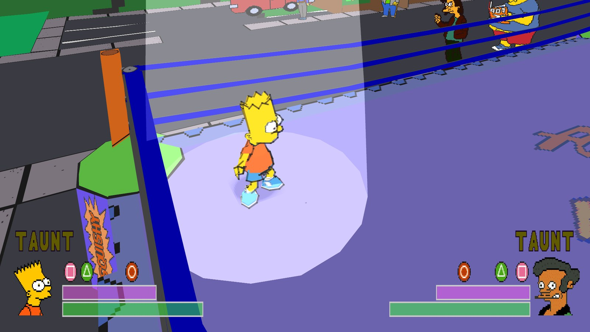</td>
<td>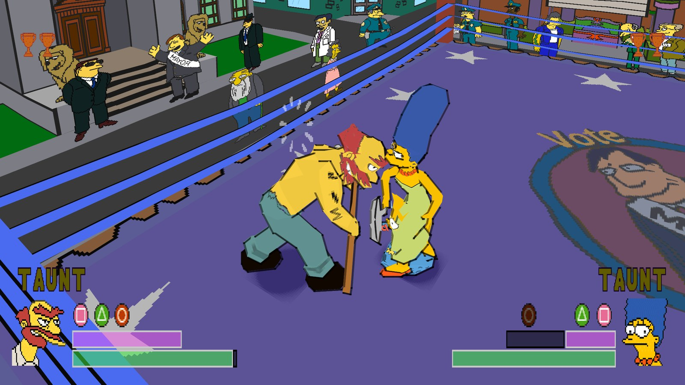</td>
</tr>
</table>

### PlayStation vs PC port

| | PlayStation | PC port |
| --- | :---: | :---: |
| Resolution | 240p | up to 7680 x 4320, or your screen's own |
| Aspect | 4:3 | 16:9 in matches |
| Frame rate | 20 to 30 fps in matches | 60 fps at the original game speed (120 experimental) |
| Geometry | wobbly polygons | stable |
| Anti-aliasing | none | supersampling and smooth outlines |
| Loading | CD speed | fast loading |
| Intro | logos and movie | skipped (optional) |
| Wrestlers and circuits | unlocked by winning | all unlocked (optional) |
| Controls | DualShock | any controller, remapping, keyboard, two players |
| Display | TV | windowed or fullscreen, any monitor, CRT filter and scanlines |

### Hotkeys

| Key | Action |
| --- | --- |
| <kbd>Alt</kbd>+<kbd>Enter</kbd> | fullscreen on or off |
| Numpad <kbd>+</kbd> / <kbd>-</kbd> | volume |
| <kbd>Shift</kbd> while starting | open the launcher |

## Controls

| PlayStation | Controller (Xbox layout) | Keyboard |
| --- | --- | --- |
| D-pad / left stick | D-pad / left stick | Arrow keys |
| Cross | A | X |
| Circle | B | S |
| Square | X | Z |
| Triangle | Y | A |
| L1 / R1 | LB / RB | Q / W |
| L2 / R2 | LT / RT | E / R |
| Start | Menu | Enter |
| Select | View | Right Shift |

Change any of them on the launcher's **Controls** page. With **Automatic** (the default), player 1 uses a controller as soon as it is switched on, and the keyboard works as well. For a VS match, switch on the second controller before pressing PLAY, or play player 2 on the keyboard against a controller.

## Getting started

**You need:** Windows 10 or 11 (64-bit), **or** 64-bit Linux from 2023 or later (glibc 2.38), a graphics card with OpenGL 3.3, and your own disc image of **The Simpsons Wrestling** for the PlayStation, North American release (**SLUS-01227**), as a `.cue` file with its `.bin`.

1. Download **SimpsonsWrestling-v...-windows-x64.zip** from the [latest release](https://github.com/TekRantGaming/simpsons-wrestling-recompiled/releases/latest) and unzip it anywhere.
2. Run **SimpsonsWrestling.exe**. The launcher opens.
3. On the **Game** page click **Browse for the .cue file...** and pick your disc image, or drop the `.cue` onto the window. The launcher checks that it is the right disc. The `.bin` must sit next to the `.cue`.
4. Press **PLAY**.

**Linux:** download **SimpsonsWrestling-v...-linux-x86_64.AppImage** instead, make it executable (right-click > Properties > Permissions, or `chmod +x`) and run it. Pick your disc the same way. The program, your settings and your saves go into a `SimpsonsWrestling-data` folder next to the AppImage; a newer AppImage keeps your settings and saves.

<sub>Windows may warn that the program is from an unknown publisher (it is not code-signed). Choose **More info**, then **Run anyway**.</sub>

**No game files are included.** The download is only the port: the game itself comes from your own disc image.

## Good to know

- **Saves** are memory card files in the `saves` folder next to the game (About > Open save folder). Copy that folder to keep your progress.
- **Vibration:** the game's own Options menu starts with Vibration off. Turn it on there; the launcher's Controls page sets the strength.
- **Settings** live next to the game: `launcher.txt` (the launcher), `settings.toml` (picture and sound), `input.ini` (controller) and `keybinds.ini` (keyboard).
- **Performance:** if a match runs below full speed, lower the render resolution on the Graphics page. The game keeps its normal speed either way; when the PC is busy the frame rate drops first.
- **120 FPS** is experimental. It needs a 120 Hz screen and a fast CPU, works best at low render resolutions, and you may see some flicker. 60 FPS is recommended.

## Known issues

- Pausing a match in widescreen puts the TAUNT labels back at their 4:3 positions and darkens only the middle 4:3 area until you unpause.
- 120 FPS (experimental): the ring spotlight can flicker, and on most PCs only some frames get an in-between image, so motion is not perfectly even.
- The Linux AppImage has been tested under WSL, not yet on a native Linux install or a Steam Deck.

Found something else? Please open an issue with what happened, where, and your launcher settings.

<details>
<summary><b>Building it yourself (for developers)</b></summary>

You need your own disc image: the build translates the game's code from it.

```bat
build.bat                 :: the game (clang-cl, ThinLTO, PGO)
build-launcher.bat        :: the launcher
powershell -File packaging\package_windows.ps1   :: optional: the release zip in dist\
```

For Linux, run `./build_linux.sh` and then `packaging/build_appimage.sh` in Linux or WSL. How the port works, the measurements behind it and the full build notes are in [docs/TECHNICAL.md](docs/TECHNICAL.md).

</details>

## Credits

- **The Simpsons Wrestling** by Big Ape Productions, published by Fox Interactive and Activision in 2001.
- [**psxrecomp**](https://github.com/mstan/psxrecomp) and its contributors, which translate the PlayStation code and run it.
- The [**TRG Launcher**](https://github.com/TekRantGaming/trg-launcher).
- Cheat-code research for the NTSC-U unlock flags: the CodeBreaker code lists at almarsguides.com.

> [!NOTE]
> **AI disclosure:** this port was made almost entirely with Claude Code (Anthropic). The repository owner directed and tested the work; the AI did the analysis, code, tools and documentation.

> [!IMPORTANT]
> This project is not affiliated with or endorsed by Fox Interactive, Activision, Big Ape Productions, Gracie Films or 20th Television. The Simpsons is a trademark of its respective owners. It contains no game code or assets. Do not open issues asking for game files.
